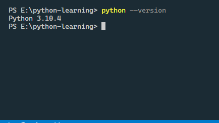

## Downloading Python
- [Python.org](https://www.python.org/)

## Installing Python
- Download windows/mac/linux version and then install accordingly
- Make sure to check `add source to path` when asked or [set the path](https://realpython.com/add-python-to-path/)

## Checking Python Version
- In windows `python --version`
- In Linux or mac `python3 --version`

## Python is Stable
- Python is known for stability. No major breaking changes happen. One major breaking change happened when python was updated from python2 to python3.

## Python with VS code
- Pretty straightforward
- Install python correctly, Set path if requires
- Open a directory in vs code
- Create a file with `.py` extension
- Write code
- Open Vs code terminal, go to the directory where your python file is present
- Type `python file_name.py` to run your file. (For linux and mac users `python3 file_name.py`)
- For running without typing commands, we can download vs code python extensions.

## Online Compilers
- [Online gdb]()
- [Google Colab]()
  - Good for seeing output.

## Anaconda and Miniconda
- Good for Data exploration and tranformation, Visualization, AI and Machine Learning