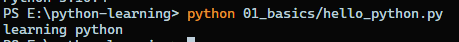
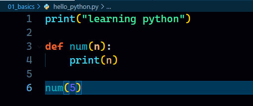
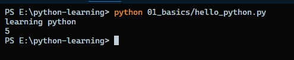
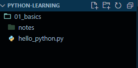
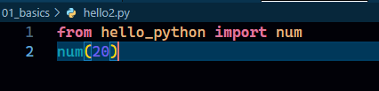
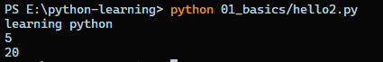
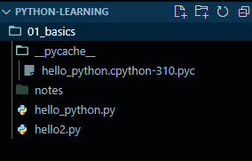
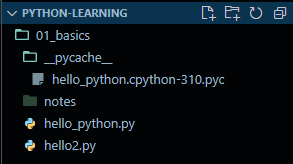

## First Program in Python

- `hello_python.py`
  - ```
        print("learning python")
    ```
- Output after running this
  - 

## An interesting thing

- We have created `hello_python.py`.
- Now add the following code (No need to understand - just follow)

  - ```
      def num(n):
        print(n)

      num(5)
    ```

    

- This is just a function. Now if we run this. Output

  

- Directory

  

- Now we will create one more file `hello2.py` in the same directory and will call the `num` function from this file

  

- Now after running this file. Output

  

- Nothing extraordinary in output
- But there will be a change in the directory.

  

- A new folder named `__pycache__` has been created with a `.pyc` file inside it.

  

- So this compels us to study about **Inner working of Python** which will be done next.
