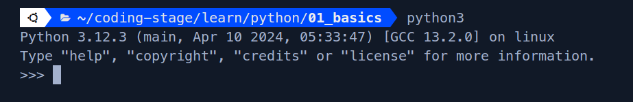
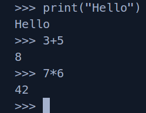
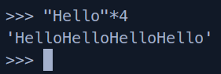
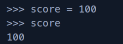
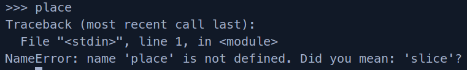

 # Python in shell
 - **Running Python in Terminal/Shell**
   - Type `python3` for Linux/Mac Users and `python` for Windows Users in the terminal to enter python shell.
   

- **Exiting from Python Shell/Terminal**
  - `Ctrl + D` => Terminate Fully or `Ctrl + Z` => Suspended State

- **About this shell**
  - In this shell, we can directly write python code but it won't be saved.
  - For example: Type `print("Hello")` and press enter. Hello will be printed immediately.
  - We can do basic calculations here also.
  
  - But it is not really made for calculating. It is used to test a piece of python code quickly without creating any file.
  - Suppose, I want to see what happens when I multiply a string by any number. Instead of going through the process of creating -> saving -> running a file. I can directly test here.
  

- **Variables in shell**
  - Type `score=100` in the shell and press enter. There won't be any output, as we have just stored a value.
  - To print the value type `score`
  
  - Try to print a variable that hasn't been defined. Such as `place`. It will give an error.
  
  