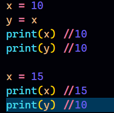

### Mutable and Immutable in Python
- Mutable objects are those that allow you to change their value or data in place without affecting the object’s identity. In contrast, immutable objects don’t allow this kind of operation. You’ll just have the option of creating new objects of the same type with different values.
- **Mutable**: `List`,`Set`,`Dictionary`,`ByteArray`,`Byte`
- **Immutable**: `Integers`, `Float`,`Boolean`,`String`,`Tuple`,`Frozen Set`,`Bytes`

- Consider the following code:
  
  

- We can see that, even after we reassign 15 to x, the value of y doesn't get updated.
- If you have done coding in any language before, you might think that, what's the difference, In C++/Java/Js etc when we will do this, we will get the exact same output.
- But it is not about output, It is about internal working.
- A simple diagram comparing this:
    
    
    
- Explaination:
  - In Python, when we perform x = 15 after initially assigning x = 10, a new integer object with the value 15 is created, and the variable x is then reassigned to reference this new object. The original object with the value 10 still exists in memory, but x no longer references it. Eventually, the Python garbage collector will reclaim the memory occupied by the old object if there are no other references to it.
  - On the other hand in languages like Java, C++, and JavaScript, when we perform x = 15 after initially assigning x = 10, the same variable x is modified to contain the new value 15. The value is updated in place, and there's no need to create a new object. Other variables that were assigned the original value of 10 remain unaffected. And that's how python primitive types are immutable.

[More in detail in this blog](https://ioflood.com/blog/mutable-vs-immutable-in-python-object-data-types-explained/#:~:text=Mutable%20objects%20in%20Python%20are,strings%2C%20integers%2C%20or%20tuples.)

